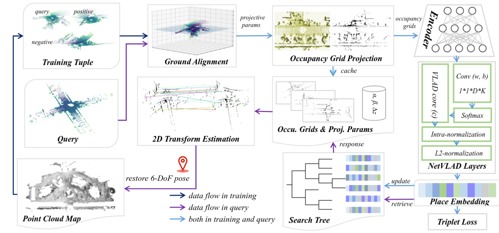

### Global Localization in Large-scale Point Clouds via Roll-pitch-yaw Invariant Place Recognition and Low-overlap Global Registration

Zhong Wang1, Lin Zhang1, Shengjie Zhao1, and Yicong Zhou2

1School of Software Engineering, Tongji University, Shanghai, China

2Department of Computer and Information Science, University of Macau, China

---

#### Introduction

>  This is the website for our paper "Global Localization in Large-scale Point Clouds via Roll-pitch-yaw Invariant Place Recognition and Low-overlap Global Registration".

Figure 1. Overview of our framework. In the offline RpyPR training phase, sampled query-positive-negative tuples are aligned to the ground to derive projection parameters. With these parameters, 2D occupation grids are projected from the 3D occupancy voxels. Such 2D grids are subsequently fed into a deep encoder and NetVLAD layers to aggregate place embeddings, which are used to update the search tree and network under the supervision of the triplet loss. During online global localization (RpyPR recognition and LoPcGR registration), the query obtains its place embedding and employs it to retrieve the response and the corresponding occupancy grids from the gallery. At last, by estimating the transformation between the 2D grids and combining the projection parameters, the full 6-DoF pose can be determined.

---

#### Source Codes

[GLoc Codes](https://github.com/peterWon/GLoc3D)
