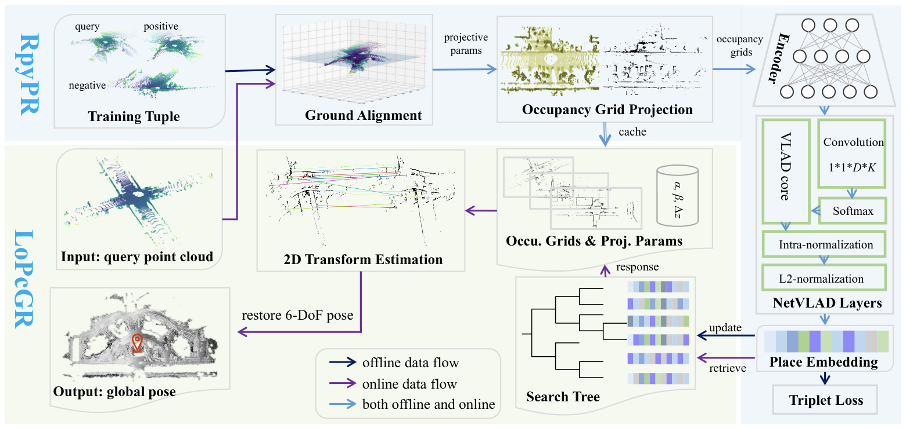

### Global Localization in Large-scale Point Clouds via Roll-pitch-yaw Invariant Place Recognition and Low-overlap Global Registration

Zhong Wang1, Lin Zhang1, Shengjie Zhao1, and Yicong Zhou2

1School of Software Engineering, Tongji University, Shanghai, China

2Department of Computer and Information Science, University of Macau, China

#### Introduction

>  This is the website for our paper "Global Localization in Large-scale Point Clouds via Roll-pitch-yaw Invariant Place Recognition and Low-overlap Global Registration".

Figure 1. (a) Overview of our approach. In offline training, sampled query-positive-negative triples are aligned to the ground to obtain projection parameters. With these parameters, 2D occupation grids are projected from the 3D occupancy voxels. Such 2D grids are further fed into a deep encoder and NetVLAD layers to aggregate place embeddings, which are used to update the search tree and network under the supervision of triplet loss. In the online localization, the query obtains place embedding as the triples in training and employs it to retrieve the response and the corresponding occupancy grids from the database. At last, by estimating the transformation between the 2D grids and combining the projection parameters, the complete 6-DoF pose can be restored.

#### Source Codes

[GLoc Codes](scan-to-scan.zip)

